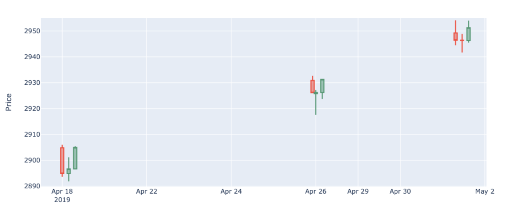

# Machine-Learning-Candlestick-Recognition-Trading-Strategy-
Columbia University FinTech BootCamp Project 2

# Description

This project identifies multiple candlestick patterns using Python, which are used to feed into machine learning models (Naive Bayes Model and Artificial Neural Network Model) that will predict market movement based off of multiple pattern factors. While there are strategies to trade based on one candlestick pattern, using multiple patterns paired with machine learning gives us the confluence needed to make more confident trades.

---

# Research Questions to Answer
How well can we train a machine learning model to identify certain candlestick formations? Can we create a profitable trading strategy based off the model's candlestick formation identification?

---

# Technologies
This project leverages JupyterLab to use the following technologies:
* Python 3.9 
* Numpy version: 1.21.5
* Pandas version: 1.3.5
* Sklearn version: 1.0.2
* Keras version: 2.10.0 

---

# Libraries

 

---

# Data
S&P500 high, low, open, and close prices from October 03, 2018 - October 4, 2022 was downloaded from TradingView on an hourly timeframe

---

# Creating OHLC function to Plot Candlestick Patterns

 

**Candlestick Plot - Sample Size**
 

---

# Part 1: Identifying Candlestick Patterns to create a target dataset for our model 

**Candle Sticks Names | Code**

- Bullish harami: BLLHRM
- Bearish harami: BERHRM
- Red hammer: RDHM
- Green hammer: GRNHM
- Bull kicker: BLLKCK
- Bear kicker: BERKCK
- Morning star: MRNSTR
- Evening star: EVNSTR
- Green shooting star: GRNSSTR
- Red shooting star: RDSSTR

### Our first major hurdle with this project was accurately identifying Morning Star and Evening Star patterns, our initial plan was to use TA-Lib and the built in candlestick recognition functions. But after plotting the identified patterns we felt unsatisfied with the results and sought alternative methods.
### We found a project containing functions to identify the patterns we needed, but we felt the morning star and evening star functions needed some tuning. After tuning those two functions, we found all other functions in the referenced project to be accurate and effective for our purposes.
#### https://github.com/aliisoli/candlesticks_study/blob/master/Candlesticks_Historical_Analysis.ipynb
### All of the pattern recognition functions identified the final candlestick (row) in the pattern within the DataFrame. Each identified row and the necessary preceding rows were added to a new dataframe in order to generate a visualization containing only every identified pattern. Our identified patterns were then compared with industry standards to check the accuracy of our candlestick identification functions.

Examples of Morning Star and Evening Star pattern plots can be seen below.

**Morning Star**

**Evening Star**

**Candlestick Pattern Frequency**

---

# Part 3: Machine Learning Models

1. Training Naive Bayes Model with Sklearn
- CategoricalNB
- GaussianNB

2. Artificial Neural Network Model

**Steps:**
- Drop columns
- Transform the Target column to dummy variable
- Scale the dataset
- Split the data to training and testing set
- Train the model
- Test the model
- Evaluate the model
- Reduce the target class to two
- Train new models
- Evaluate the model

**Evaluating Model Performance:**
We found that GaussianNB model was accurate 28% of the time, the Naive Bayes CategoricalNB model only performed at 26%, and the ANN was 51% accurate.

***Candlestick Pattern Frequency***

---

# Conclusion

After applying various methods of data preprocessing, model training, and testing, our best accuracy score was 51%. We conclude that the small target dataset, and the non-evenly distributed frequencies of the targets resulted in the models poor performances.

**Approach to solving the issues**
- Class imbalance issue: Included 'stratification' when doing train test split of the dataset.
- Data encoding and scaling: Scaled the dataset when necessary, encode the label as binary or as 'numeric categories'
- Model Accuracy: Use different models and tuning techniques to improve model accuracy.

---

# Next Steps

- Enrich our dataset
- Further Tune the Model
- Incorporating the model into our trading strategies
- Analysis of market performance after pattern identification 
- Formulate and backtest a trading strategy
- Connect to AWS to run during market hours and identify in real time
- Connect to a broker to make automated trades

---

# License & Credits
- Columbia Engineering FinTech Bootcamp
- Credit to https://github.com/aliisoli/candlesticks_study/blob/master/Candlesticks_Historical_Analysis.ipynb for candlestick identification functions

